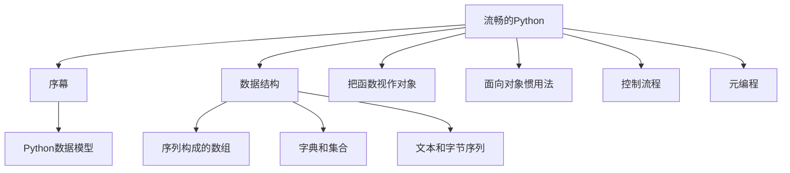

# python-programing

## 流畅的Python

```mermaid
graph TD;
    流畅的Python-->序幕;
    序幕-->Python数据模型;

    流畅的Python-->数据结构;
    数据结构-->序列构成的数组;
    数据结构-->字典和集合;
    数据结构-->文本和字节序列;

    流畅的Python-->把函数视作对象;

    流畅的Python-->面向对象惯用法;

    流畅的Python-->控制流程;

    流畅的Python-->元编程;
```

## Python核心编程

```mermaid
graph TD;
    A-->B;
    A-->C;
    B-->D;
    C-->D;
```
